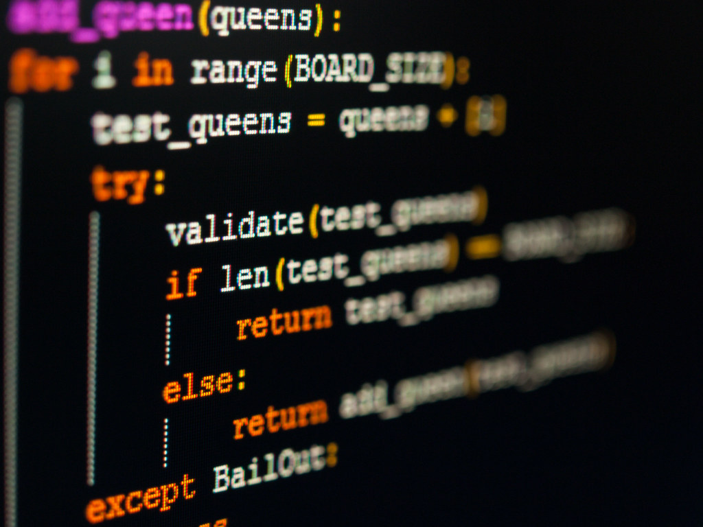

## My name is Max, I am studying to be a python developer backend



This place for any discriptions. About my.

### Markdown

Markdown is a lightweight and easy-to-use syntax for styling your writing. It includes conventions for

```markdown
THis place for any CODE </ > 
```
